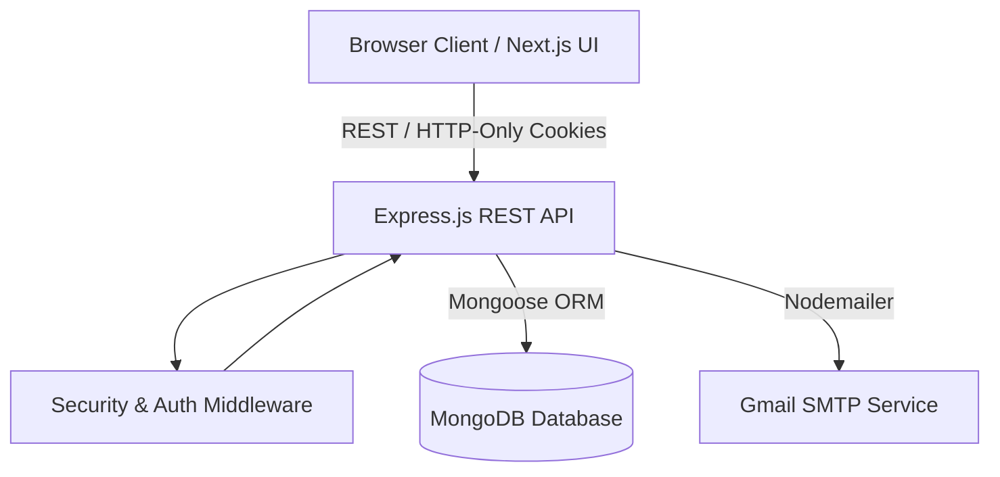
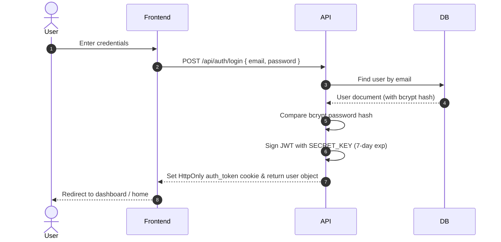
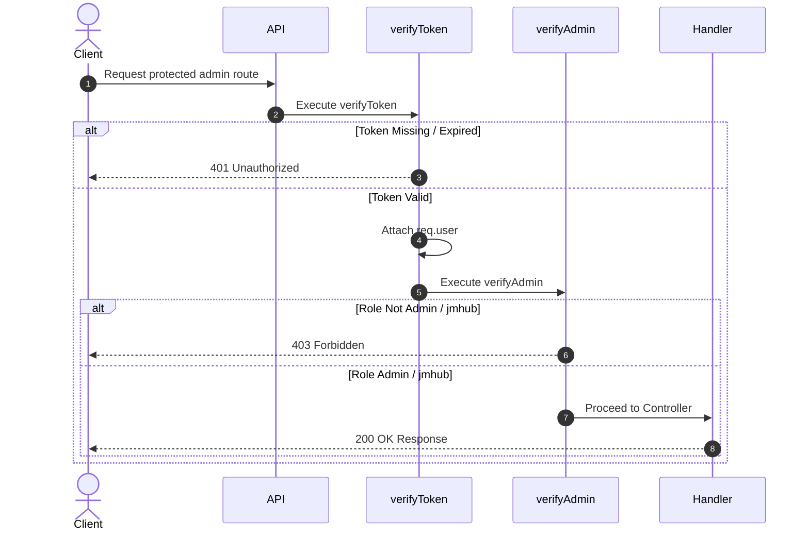
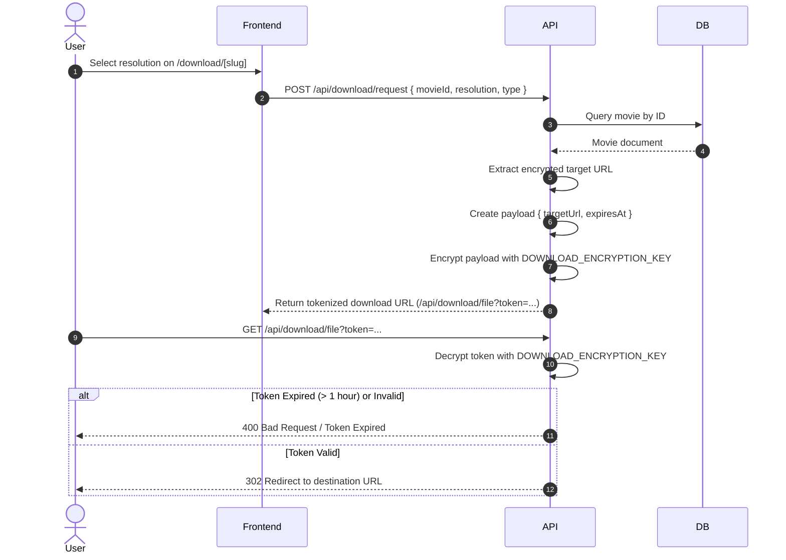

# Moybd System Architecture

## System Overview

Moybd is structured as a decoupled multi-tier web application consisting of a Next.js App Router frontend, an Express.js REST API backend, and a MongoDB document database. Communication between the frontend and backend occurs over HTTP/HTTPS REST endpoints, with authentication state managed via HTTP-Only JSON Web Token (JWT) cookies.

---

## Frontend Architecture

The frontend is built on Next.js 15 using the App Router model.

- **Component Layer**: Standardized UI components ([`Navbar`](file:///media/akram/code4/Project/Moybd--Movie-Streaming-Entertainment-Platform/frontend/app/component/Navbar.jsx), `Footer`, `HeaderSlider`, `MovieCard`, `Comments`, `Button`, `Toast`).
- **Dynamic Routing**:
  - `app/[genre]/page.jsx`: Single dynamic listing route handling category and genre views (`/Action`, `/Bollywood`, `/movies`, `/series`, etc.).
  - `app/download/[slug]/`: Movie detail and download gate page. Uses `layout.js` Server Component for `generateMetadata()` SEO generation and `page.js` Client Component for interactive download token requests.
  - `app/admin/`: Protected admin panel routes (`/admin`, `/admin/users`, `/admin/movie`, `/admin/addmovie`, `/admin/draft`, `/admin/Comments`, `/admin/update/[id]`).
- **State & Session Management**: Local component state paired with session storage and cookies (`auth_token`). User role and authentication state verified against backend endpoint `GET /api/auth/me`.

---

## Backend Architecture

The backend is a Node.js application using Express.js with ES Modules syntax.

- **Entry Point**: `backend/main.js` initializes environment variables via `dotenv`, establishes MongoDB connection via Mongoose, attaches global middleware (`cors`, `helmet`, `morgan`, `express.json`), and mounts API routers.
- **Routing Layer**: Express Routers modularized under `backend/api/`.
- **Controller Layer**: Business logic separated under `backend/controllers/`.

---

## API Layer

The API surface is structured into discrete domain routers:

- `/api/auth`: Registration, verification, login, logout, password reset, profile verification (`/me`).
- `/api/dashboard`: Catalog queries (`/publicmovies`, `/latestmovies`, `/movie`, `/series`), server-side search (`/search`), and admin user/draft management.
- `/api/movie`: Movie CRUD mutations (`/post`, `/:id`).
- `/api/genre`: Public category queries (`/Action`, `/Bollywood`, `/Horror`, etc.).
- `/api/comments`: Public comment posting and admin comment moderation.
- `/api/download`: Single-use encrypted download link generation and resolution.
- `/api/captcha`: Google reCAPTCHA site verification.
- `/api/contact`: Contact form submissions.

---

## Middleware

1. **`helmet({ crossOriginResourcePolicy: false })`**: Sets HTTP security headers (X-Content-Type-Options, X-Frame-Options, Strict-Transport-Security).
2. **`cors(corsOptions)`**: Restricts cross-origin HTTP requests to configured allowed domains (`process.env.ALLOWED_ORIGINS`).
3. **`morgan('combined')`**: Logs incoming HTTP requests to standard output.
4. **`verifyToken`**: Extracts and validates JWT from `auth_token` cookie or `Authorization: Bearer <token>` header. Attaches `req.user`.
5. **`verifyAdmin`**: Ensures `req.user.role === 'admin' || req.user.role === 'jmhub'`.
6. **Rate Limiters** (`express-rate-limit`):
   - `loginLimiter`: 10 requests / 15 mins.
   - `registerLimiter`: 5 requests / 1 hour.
   - `forgotPasswordLimiter`: 5 requests / 1 hour.
   - `downloadLimiter`: 15 requests / 1 min.

---

## Services & Shared Utilities

- **`libs/db.js`**: Mongoose connection manager with connection caching.
- **`libs/sanitize.js`**: `sanitizeMovieForPublic(movieDoc)` strips raw encrypted download URLs and returns available resolution flags and episode metadata for public callers.
- **`controllers/crypto.js`**: AES-256-CBC encryption and decryption helper functions (`encryptAES`, `decryptAES`) used by the download subsystem.

---

## Database Schema

Database storage is managed via Mongoose models:

### 1. `User` Model (`users` collection)
- `name`: String (required)
- `email`: String (required, unique, indexed)
- `password`: String (bcrypt hash, required)
- `role`: String (enum: `['admin', 'jmhub', 'user']`, default: `'user'`)
- `timestamps`: true

### 2. `Movie` Model (`movies` collection)
- `title`: String (required)
- `slug`: String (unique, sparse, indexed)
- `bgposter`, `smposter`: String (poster image URLs)
- `titlecategory`: String (`'Movies'`, `'Series'`, `'Shows'`)
- `category`, `genre`: Array of strings
- `description`, `rating`, `duration`, `year`, `language`, `subtitle`, `size`, `quality`: String
- `downloadlink`: Map of resolutions (`360p`, `480p`, `720p`, `1080p`, `4k`) to AES-encrypted target URLs
- `episodes`: Array of episode objects (containing `episodeNumber`, `title`, encrypted `downloadlink`, `watchonline`)
- `zipDownloadLink`: Map of resolutions to AES-encrypted zip package URLs
- `watchonline`: String (encrypted online streaming URL)
- `status`: String (`'Publish'`, `'Draft'`)
- `comments`: Array of ObjectId refs to `Comment`
- `indexes`: `{ status: 1, category: 1 }`, `{ status: 1, titlecategory: 1 }`

### 3. `Comment` Model (`comments` collection)
- `postId`: ObjectId ref to `Movie`
- `userId`: ObjectId ref to `User`
- `commentName`: String
- `title`: String
- `comment`: String
- `status`: String (`'Publish'`, `'Draft'`)

### 4. `Token` Model (`tokens` collection)
- `email`: String (indexed)
- `code`: String (indexed)
- `type`: String (`'verification'` or `'reset'`)
- `payload`: Object (registration payload container)
- `createdAt`: Date (TTL index: `expires: 600` — 10 minutes automatic expiration)

---

## Authentication Flow

---

## Authorization Flow

---

## Download System Architecture

Download links are protected via server-side AES encryption and tokenization. Raw download URLs are never exposed in public API responses.

---

## Admin System

The admin subsystem is accessed under `/admin`.
- **Session Verification**: `app/admin/layout.jsx` performs a server fetch to `GET /api/auth/me` on mount. If the user does not possess `admin` or `jmhub` role, access is denied.
- **Operations**:
  - User Management: View user list (passwords excluded), change user roles, delete user accounts.
  - Catalog Management: Publish new movies/series, edit title metadata, update episode structures, delete titles, manage drafts (`/admin/draft`).
  - Comment Moderation: Approve or delete user comments (`/admin/Comments`).

---

## Media / Upload System

> [!NOTE]
> **NOT IMPLEMENTED (External Media Hosting)**: Moybd does not store or process binary media files locally. All posters, video streams, and download targets are stored as external HTTP/HTTPS URL strings referencing external CDNs or storage providers.
